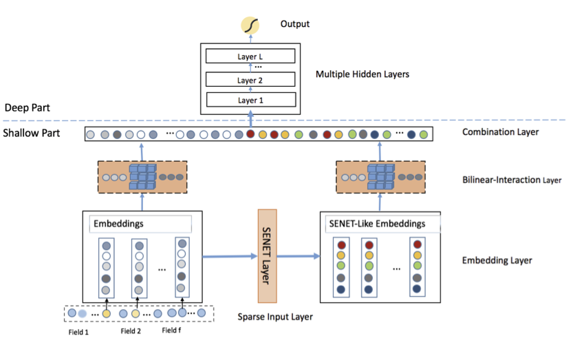
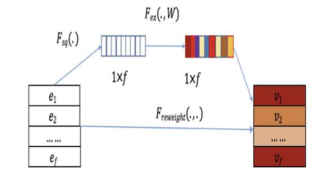
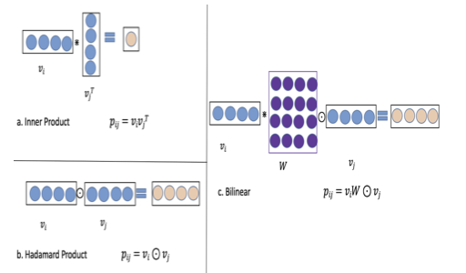
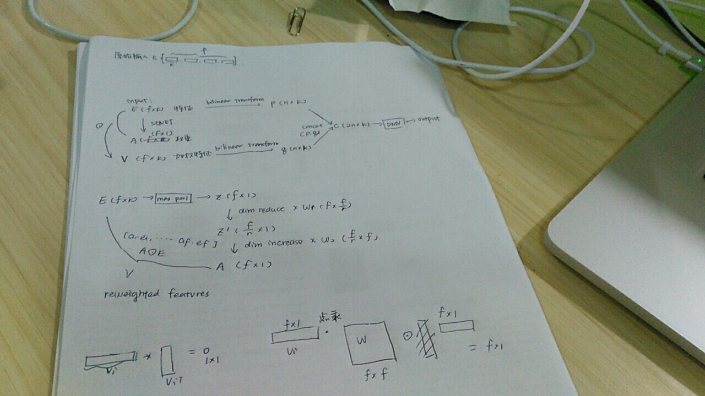

FiBiNET全称Feature Importance and Bilinear feature Interaction NETwork[^1]，是新浪微博提出的一种基于深度学习的广告推荐/点击率预测算法。不例外的，可以认为FiBiNET是在Google在2016提出的wide & deep learning算法[^2]（以下简称WDL，推荐系统中影响非常深远的一个base model）基础上对它的wide部分进行了一些创新的改进，或者直接视为FNN[^3]的一个变体。主要的创新点在于

- 在传统的embedding stage加入了一个SENET层对已经完成embedding的特征再做了embedding，得到了与特征重要性（Feature Importance）相关的信息
- 再把这些信息连同原始的embedding feature一起结合起来生成新的特征向量后，不使用传统的inner product或Hadamard product方法，而是选择了结合二者的一种新的bilinear interaction方法来获得特征之间的联系

总的来说是一篇非常清爽干净的工业界论文，读起来很快。我自己也按照论文的方法尝试了一些分类问题的并不干净整洁的工业界数据，取得了不错的效果。目前也有[DeepCTR](https://github.com/shenweichen/DeepCTR)这样的库封装了它的实现，有兴趣可以自己去阅读源码，使用和改进。这里简单的介绍这篇文章提出的方法和我在它的实践上总结的一些经验。

## 框架

简单的工作流程为：

1. $f$个稀疏高维的原始特征数据首先经过一层embedding层得到低维稠密特征构成的实数向量 $E=[e_1,e_2,\ldots,e_f]$，其中每个$e_i \in R^k$，$k$为embedding层的维度，有些实现中为参数`embedding_size`
2. 把$E$作为输入传入一个类似于SENET的结构，得到这些特征的权重向量$A=[a_1,\ldots,a_f]$，$a_i$为标量，所以$A \in R^f$
3. 把1的结果即原来的$E$乘以2得到的权重$A$得到一个新的embedding向量$V=[v_1,\ldots,v_f]$，维度不变，$v_i \in R^k$
4. $E$经过bilinear函数的转换得到一个包含特征之间的关联的向量$p=[p_1,\ldots,p_n]$,其中$n$的大小为特征数$f$的二元组合数$f(f-1)/2$，后面会详细讲。而每个$p_i \in R^k$保持不变
5. $V$经过bilinear函数的转换得到一个包含特征之间的关联的向量$q=[q_1,\ldots,q_n]$，$n$同上，依然有$q_i \in R^k$
6. 在combination层把4和5的输出$p$和$q$简单的连接为$c=[p,q]=[c_1,\ldots,c_{2n}]$
7. 最后把$c$送到多层全连接的神经网络结构，也就是我们通常说的DNN，得到最终的输出。

当然这里的deep部分结构非常传统没什么可多解释的，比较有新意需要详细说明的是浅层网络里如何使用SENET得到特征的权重得分，以及如何用bilinear函数计算特征之间的关联。

## SENET-like Layer

SENET全称Squeeze-and-Excitation Network[^4],在CV中用的比较多，可以对特征间的依赖关系进行一定的提取。SENET一共分为三个部分：Squeeze，Excitation和Re-Weight，按照顺序执行后从原始的embedding特征向量$E$得到加权后的$V$

### Squeeze

简略的说就是对$E$做一次最大池化，原文中这个地方给出的是一个平均池化的公式，也是原始的SENET用的池化方法，然而FiBiNET用到的实际是类似于$$z_i=F_{sq}(e_i)=\max_{0\le t<k}{e_i^{(t)}}$$的操作，先把$E$压缩为向量$Z=[z_1,\ldots,z_f]$，其中每个$z_i$都是标量。

### Excitation
这一步通过两个全连接层（Fully-connected,FC）对$Z$进行一次降维到$f/r \times 1$维再进行一次升维恢复到原来的$f \times 1$维，得到特征的权重得分$A=[a_i,\ldots,a_f]$，每个$a_i$为标量，整个过程可以表示为$$A= F_{ex}(Z)=\sigma_2(W_2(\sigma_1(W_1 Z)))$$其中$\sigma_1$和$\sigma_2$为activation function,权重向量$W_1 \in R^{f \times f/r}$和$W_2 \in R^{f/r \times f}$都在训练时期通过动态的学习获得，并在之后参与表现每个$e_i$的权重，$r$表示维度的缩减比例(reduce ratio)

### Re-Weight

最后一步是把$A$和$E$按照类似于Hadamard product的方法对其中的$f$个元素进行element-wise的相乘得到SENET的最终产出$V$，如果把$A$视为一个权重向量，那么这一步也可以被叫做加权或rescale
$$\begin{align}
V & =F_{ReWeight}(A,E) \\
  & = [a_1 \cdot e_1,\ldots,a_f \cdot e_f] \\
  & =[v_i,\ldots,v_f]
\end{align}$$ 最终得到一个包含了特征权重信息的新的特征向量$V$,其中$v_i \in R^k$

$V$与原始的输入$E$分别经过Bilinear-interaction层后得到$p$和$q$连接起来就是DNN部分的输入。

## Bilinear-interaction

interaction层用于计算特征的二阶关联，一定程度上生成了特征之间的二元组合，一般是用inner product($\cdot$)或者Hadamard product($\odot$)去做。由于这两种方法过于naive，例如
$$\begin{align}
[a_1,a_2,\ldots,a_n]\cdot [b_1,b_2,\ldots,b_n] & = \sum_{i=1}^{n}{a_i b_i} \\
[a_1,a_2,\ldots,a_n]\odot [b_1,b_2,\ldots,b_n] & =[a_1b_1,a_2 b_2,\ldots,a_n b_n]
\end{align}$$

稀疏特征之间的组合无法很好的被表现出来。所以文中提出了一个新方法，放弃了直接相乘的粗暴做法，选择在特征$v_i$和$v_j$之间加入了一个$(k \times k)$的权重参数矩阵$W$进行这样的计算$$p_{i,j} = v_i \cdot W \odot v_j$$ 为生成的新特征，$p_{i,j} \in R^k$

为避免重复计算二阶组合，这里规定$i<j$，所以共有$n={f \choose 2}=f(f-1)/2$个$(v_i,v_j)$的组合需要经过上面的计算。最后$p=[p_1,\ldots,p_n]$作为这一层的输出结果，$p \in R^{n\times f}$

$W$在训练的过程中可以动态的学习到特征之间的组合关系，无疑增加了模型的表达能力。当然关于要选择多少个$W$也在后文中具体讨论了3种可选择的做法：

1. **Field-All**: 所有的向量都共用一个$W$
2. **Field-Each**: 每个在左边的$v_i$有一个对应的$W_i$，一共需要训练$f$个$W$
3. **Field-Interaction**: 对每个$(v_i,v_j)$单独训练一个特定的$W_{i,j}$，共有$f(f-1)/2$个$W$需要训练

经过这一层的变换后，从$E$输出了$p$，从$V$输出了$q$,把它们组合为$[p,q]$作为DNN的输入即可，后面的DNN就比较中规中矩，不再赘述了。

## 彩蛋

附赠一张本抠脚大汉在读这篇论文时写的笔记草稿

## 一些实现和使用的反思

我是在直接用DeepCTR中所有模型尝试业务数据时发现FiBiNET有非常稳定的高准确率表现所以开始找它的原理和实现，希望能总结一些经验和可以尝试的改进方法，也就是记录一下to do list

### 适用的数据集
虽然模型是针对点击率预测的场景提出的，但可以尝试的数据场景也不少，比较适合包含大量categorical feature且这些feature cardinality本身很高，或者因为encode method导致的某些feature维度很高且稀疏的情况。推荐系统的场景因为大量的user/item属性都是符合这些要求的，所以效果格外好，但我们也可以举一反三把它推广到其他相似场景。另外，文字描述类的特征（比如人工标注的主观评价，名字，地址信息……）可以用tokenizer处理成int sequence/matrix作为embedding feature喂进模型，丰富的interaction方法可以很好的学习到这些样本中这些特征的相似之处并挖掘出一些潜在的关系。

回归和分类问题都可以做，无非改一下DNN最后一层的activation函数和objective，没有太大的差别。

如果dense feature比较多而且是分布存在很多异常值的numeric feature，尽量就不要用FiBiNET了，相比大部分NN没有优势不说，SENET那里的一个最大池化极其容易把特征权重带偏，如果一定要上，可能需要修改一下池化的方法。

### DeepCTR相关实现

DeepCTR库中的[相关实现源码](https://deepctr-doc.readthedocs.io/en/latest/_modules/deepctr/models/fibinet.html#FiBiNET)的架构和原论文有一定的差异。原论文所做的工作约等于这个模块里面处理sparse feature部分的工作，除了原论文的工作，这里的实现还把指定的linear feature作为类似于WDL中的wide部分直接输入到DNN的最后一层，以及DNN部分也吸收了一部分指定的dnn feature中的dense feature直接作为输入。毫无疑问，DeepCTR作者在尽可能的保留更多的特征作为输入防止信息的丢失。

### 一些琐碎的实践经验

- 因为模型本身不够深也不算复杂（原文是3层hidden layer，DeepCTR默认2层），GPU对它几乎没有加速
- 使用Field-Each方式能够达到最好的预测准确率，而且相比默认的Field-Interaction，参数也减少了不少，训练效率更高。当然，三种方式在准确率方面差异不是非常巨大。
- `reduce ratio`设置到8效果最好，这方面我的经验和不少人达成了共识，SENET用于其他学习任务也可以得到相似的结论（见[Squeeze-and-Excitation Networksの効果を確かめる](https://qiita.com/koshian2/items/6742c469e9775d672072)）当然这里很玄学，我没有测试足够多的数据集，这部分可能需要根据个人任务在tuning过程中自己探索。
- 使用dropout方法扔掉hidden layer里的部分unit效果会更好，系数大约在0.3时最好，原文用的是0.5,请根据具体使用的网络结构和数据集特点自己调整。

### 接下来准备做的一些工作

- [ ]  ~~用LaTeX/Tikz把笔记草稿上的图画出来并开源，让数据流和操作更一目了然~~
- [ ] 尝试在DNN部分使用残差防止DNN效果过差
- [ ] 直接取出Bilinear的输出结果然后上XGBoost，也就是说不用它来训练而是作为一种特征embedding操作去使用
- [ ] 在WDL上的调优经验： 适当调整DNN hideen layer之间的unit数量的减小比例，防止梯度爆炸/消失。

[^1]: Huang, Tongwen, Zhiqi Zhang, and Junlin Zhang. "[FiBiNET: Combining Feature Importance and Bilinear feature Interaction for Click-Through Rate Prediction.](https://arxiv.org/pdf/1905.09433)" *arXiv preprint arXiv:1905.09433* (2019).

[^2]: Cheng, Heng-Tze, et al. "[Wide & deep learning for recommender systems.](https://arxiv.org/pdf/1606.07792.pdf)" *Proceedings of the 1st workshop on deep learning for recommender systems.* ACM, 2016.

[^3]: Zhang, Weinan, Tianming Du, and Jun Wang. "[Deep learning over multi-field categorical data.](https://arxiv.org/pdf/1601.02376)" *European conference on information retrieval.* Springer, Cham, 2016.

[^4]: Hu, Jie, Li Shen, and Gang Sun. "[Squeeze-and-excitation networks.](http://openaccess.thecvf.com/content_cvpr_2018/papers/Hu_Squeeze-and-Excitation_Networks_CVPR_2018_paper.pdf)" *Proceedings of the IEEE conference on computer vision and pattern recognition.* 2018.
