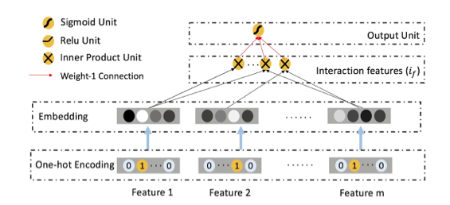

ONN全称Operation-aware Neural Networks，是在[Operation-aware Neural Networks for User Response Prediction](https://arxiv.org/abs/1904.12579)中提出的一种新的用于点击率预测/广告推荐的深度学习网络模型，相比之前的同类模型，不同点在于丰富了embedding表达的处理：对于每个不同的操作（复制或内积）所使用的embedding方法不同，具体来说是每个特征都要在embedding层训练足够多的系数，产生足够多的中间结果向量，用于后面一次性的内积或其他操作。


初见这篇文章我是有点抗拒的，我第一反应判断这是灌水文，因为文章本身的影响力几乎没有，写作的方式和结构也不是很好，表达有些混乱，符号标记也不是很严谨规范，关键的是文章提出的思路我认为也不是特别精巧，也没有比较solid的工业级落地数据支持。不过实在扛不住它在业务数据上的表现优异，而且这几天也请假回家陪家人了难免有点不能继续工作的寂寞感，就顺带陪老人孩子聊天和洗菜做饭的时候顺带把这篇信息量不是很大的文章读完了，总结一下论文的方法和可取之处。

## 框架


输入为经过one-hot encode的$m$个稀疏特征$[x_1,x_2,\ldots,x_m]$，一般的embedding处理会给每个$x_i$指定一个系数矩阵$V_i$，这一层的输出结果$[e_1,e_2,\ldots,e_m]$其中$e_i=V_i x_i$，而ONN则对$x_i$特征将要参与的每个操作分开训练embedding的系数，如果$x_i$要参与$l$个操作，那么$x_i$经过embedding的计算结果为$l$个中间向量即 $$[e_i^1,e_i^2,\ldots,e_i^l]=[V^{i,1}x_i,V^{i,2}x_i,\ldots,V^{i,l}x_i]$$这些$[V^{i,1},V^{i,2},\ldots,V^{i,l}]$需要在训练时分别获得。文中把第$i$个特征与第$j$个特征的内积操作，与第$i$个特征与第$j$个特征的内积，视为不同的操作，需要分配不同的$V$


文中在embedding层之后只使用了对单个特征的复制，以及对于特征之间两两作内积的操作，这些结果作为DNN部分的输入开始DNN的训练。DNN部分除了每层多加了batch normalize，也没任何有别于传统DNN的地方，不再展开说明。

## 与其他模型的结构对比

FM的embedding层并没有对特征区分不同的操作，embedding之后即对$e_i$进行内积操作得到结果后简单的输出最终结果


FFM相比FM在embedding层加入了文中的operation-aware操作，即对每次不同的内积操作，同一个特征的embedding方法是不同的。但相比ONN没有deep部分以及embedding的原始结果作为deep部分的输入，所以表现力还是有所欠缺。

![ffm][graph/ffm.png]

与ONN最相似的还是PNN的结构，除了ONN在embedding层没有对后续的不同操作作出区分，而ONN根据后续用以不同的操作区分生成了很多不同的embedding向量。

![pnn][graph/pnn.png]

## 源码阅读

ONN在[DeepCTR](https://github.com/shenweichen/DeepCTR)库对应的实现为NFFM模型

把关键的embedding和inner product部分代码摘出来是

```py
sparse_embedding = {fc_j.embedding_name: {fc_i.embedding_name: Embedding(fc_j.dimension, embedding_size, embeddings_initializer=RandomNormal(mean=0.0, stddev=0.0001, seed=seed), embeddings_regularizer=l2(l2_reg_embedding), mask_zero=isinstance(fc_j, VarLenSparseFeat),
                                                                         name='sparse_emb_' + str(
                                                                             fc_j.embedding_name) + '_' + fc_i.embedding_name)
                                          for fc_i in
                                          sparse_feature_columns + varlen_sparse_feature_columns} for fc_j in
                    sparse_feature_columns + varlen_sparse_feature_columns}

for fc_i, fc_j in itertools.combinations(sparse_feature_columns + varlen_sparse_feature_columns, 2):
    i_input = features[fc_i.name]
    if fc_i.use_hash:
        i_input = Hash(fc_i.dimension)(i_input)
    j_input = features[fc_j.name]
    if fc_j.use_hash:
        j_input = Hash(fc_j.dimension)(j_input)

    fc_i_embedding = feature_embedding(fc_i, fc_j, sparse_embedding, i_input)
    fc_j_embedding = feature_embedding(fc_j, fc_i, sparse_embedding, j_input)

    element_wise_prod = multiply([fc_i_embedding, fc_j_embedding])
    if reduce_sum:
        element_wise_prod = Lambda(lambda element_wise_prod: K.sum(
            element_wise_prod, axis=-1))(element_wise_prod)
    embed_list.append(element_wise_prod)
```

## 使用总结

文章里面的数据很好，当然不好是不可能发的，所以讨论这个意义不大。

我自己在业务数据上使用的效果也非常好，比其他deep based的准确率高出很多，所以我特地去把文章读了一遍，感觉有点失望，因为原理上它确实没有太惊艳的地方，所以一开始我也怀疑是不是内置的BN起了作用，于是把BN关了发现效果也没降低太多。

随着后来观察到这个模型训练起来几乎是不可接受的慢，以及模型的参数数量远超其他模型，我大概能理解到底发生了什么，这就是简单粗暴的拓宽了假设空间，计算资源足够的情况下确实会更有可能学到更多的模式。而我的测试数据量也不大，所以用起来劣势没那么明显，真正在工业级场景落地则会对算力要求极高，所以……


文章给我最大的启发就是这种细致入微的系数分配和简单粗暴的增加模型复杂度的思路，$O(n^2)$级矩阵参数的设置吊打$O(n)$说明我们目前连训练集上的精度都还有很大的提升空间，就不要想着怎样在模型大小和效率上优化了。

唉，未来工作量大的让我头皮发麻。
